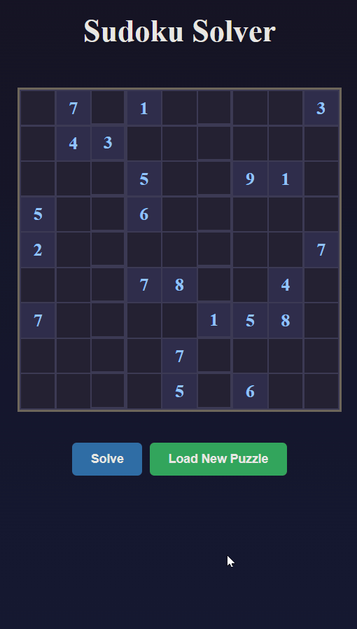

# SudokuSolver

A Sudoku solver application built for learning purposes. This project demonstrates a backtracking algorithm with Minimum Remaining Values (MRV) heuristic to solve Sudoku puzzles, with real-time visualization of the solving process.

## Tech Stack & Architecture

- **Backend**: .NET 8 with ASP.NET Core Web API
- **Frontend**: Angular 17 with TypeScript
- **Core Logic**: C# class library with solver algorithms
- **Architecture**: Clean separation of concerns with Core library for business logic, API layer for HTTP endpoints, and Angular frontend for UI

**Note**: Angular was chosen for this project for learning purposes, even though it's not the optimal choice for this use case (the input is just a few button clicks). This project serves as an educational exercise in full-stack development with modern frameworks.

## Documentation

For detailed architecture information, solver algorithms, and API documentation, see the [Project Architecture](docs/project_architecture.md) file.

## Features

- Random puzzle generation
- Backtracking solver with MRV heuristic
- Real-time visualization of attempts and backtracks
- Statistics tracking (attempts, backtracks, duration)
- Responsive web interface